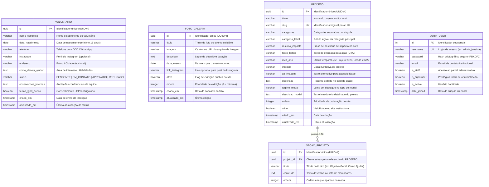

# Documentação Técnica e Acadêmica do Projeto AAPOC MT
## Plataforma Web Institucional & CMS da Associação de Apoio aos Pacientes Oncológicos de Cuiabá

---

### 1. Identificação do Projeto e Repositório

* **Instituição Atendida:** AAPOC MT — Associação de Apoio aos Pacientes Oncológicos de Cuiabá
* **Missão Social:** Acolhimento multidisciplinar, hospedagem transitória gratuita (Casa de Apoio Carmen Lúcia), nutrição hospitalar e assistência a pacientes oncológicos de Cuiabá e do interior de Mato Grosso.
* **Repositório Oficial no GitHub:** [https://github.com/KamiMonteiro/AAPOC](https://github.com/KamiMonteiro/AAPOC)
* **Estrutura:** Monorepo (`frontend/` e `backend/`)

---

### 2. Endereços de Publicação do Sistema Online (Deploy em Produção)

O backend do sistema e a camada de CMS administrativo encontram-se publicados e operacionais em nuvem:

| Serviço / Recurso | Endereço URL de Acesso | Descrição |
| :--- | :--- | :--- |
| **Painel Administrativo CMS (Domínio Oficial)** | [https://painel.aapoccba.com.br](https://painel.aapoccba.com.br) | Acesso direto à tela de gestão da coordenação da AAPOC (Unfold Theme). |
| **Painel Administrativo (Rota Alternativa)** | [https://painel.aapoccba.com.br/admin/](https://painel.aapoccba.com.br/admin/) | Acesso via rota padrão do Django Admin. |
| **Documentação Interativa Swagger (OpenAPI 3.0)** | [https://painel.aapoccba.com.br/api/docs/](https://painel.aapoccba.com.br/api/docs/) | Documentação interativa para teste e inspeção de todos os endpoints REST. |
| **Documentação ReDoc** | [https://painel.aapoccba.com.br/api/redoc/](https://painel.aapoccba.com.br/api/redoc/) | Especificação formal dos contratos de dados da API. |
| **Servidor em Nuvem (Render Host)** | [https://aapoc-backend.onrender.com](https://aapoc-backend.onrender.com) | Host de infraestrutura com balanceamento Cloudflare e SSL automático. |

> **Nota de Acesso:** As credenciais de teste para avaliação do professor são enviadas de forma privada na submissão da atividade acadêmica no AVA/portal por questões de boas práticas e segurança da informação.

---

### 3. Diagramação do Banco de Dados (DER — Diagrama Entidade-Relacionamento)

Abaixo está o modelo conceitual e lógico do banco de dados relacional implementado no backend:



---

### 4. Dicionário de Dados (Data Dictionary)

#### 4.1. Tabela `voluntarios_voluntario`
| Campo | Tipo de Dado | Restrições | Descrição / Regra de Negócio |
| :--- | :--- | :--- | :--- |
| `id` | `UUID` | PK, Not Null | Identificador global único gerado automaticamente. |
| `nome_completo` | `VARCHAR(150)` | Not Null | Nome e sobrenome do candidato a voluntário. |
| `data_nascimento` | `DATE` | Not Null | Validado no backend para exigir idade entre 16 e 100 anos. |
| `telefone` | `VARCHAR(20)` | Not Null | Telefone com DDD (10 ou 11 dígitos). Gera link wa.me dinâmico. |
| `instagram` | `VARCHAR(60)` | Default '' | Perfil social do voluntário (opcional). |
| `endereco` | `VARCHAR(255)` | Default '' | Endereço residencial ou bairro em Cuiabá/VG (opcional). |
| `como_deseja_ajudar` | `TEXT` | Not Null | Relato sobre como a pessoa pretende contribuir. |
| `status` | `VARCHAR(20)` | Not Null, Default 'PENDENTE' | Triagem interna: `PENDENTE`, `EM_CONTATO`, `APROVADO`, `RECUSADO`. |
| `observacoes_internas`| `TEXT` | Default '' | Anotações confidenciais da coordenação sobre entrevistas. |
| `termo_lgpd_aceito` | `BOOLEAN` | Not Null, Default TRUE | Autorização formal do candidato conforme a Lei Geral de Proteção de Dados. |
| `criado_em` | `TIMESTAMP` | Auto Now Add | Data e hora exata da inscrição. |
| `atualizado_em` | `TIMESTAMP` | Auto Now | Data e hora da última alteração de status/observação. |

#### 4.2. Tabela `projetos_projeto`
| Campo | Tipo de Dado | Restrições | Descrição / Regra de Negócio |
| :--- | :--- | :--- | :--- |
| `id` | `UUID` | PK, Not Null | Identificador único do projeto. |
| `titulo` | `VARCHAR(150)` | Not Null | Nome da iniciativa (ex: "Cólon e Esperança", "Casa de Apoio"). |
| `slug` | `VARCHAR(160)` | Unique, Not Null | Identificador amigável para URLs e consultas REST. |
| `categorias` | `VARCHAR(100)` | Not Null | Slugs de filtro: `acolhimento`, `saude`, `autoestima`, `empoderamento`. |
| `categoria_label` | `VARCHAR(100)` | Not Null | Rótulo exibido no card (ex: "Saúde & Dignidade"). |
| `resumo_impacto` | `VARCHAR(120)` | Not Null | Destaque numérico ou qualitativo de impacto no card. |
| `texto_botao` | `VARCHAR(60)` | Default 'Conhecer' | Texto de chamada do botão (CTA). |
| `mes_ano` | `VARCHAR(60)` | Default 'Permanente'| Indicador de período ou status da campanha. |
| `imagem` | `VARCHAR(255)` | Not Null | Arquivo de imagem enviado por upload no CMS. |
| `alt_imagem` | `VARCHAR(200)` | Default '' | Texto descritivo para leitores de tela e acessibilidade. |
| `descricao` | `TEXT` | Not Null | Resumo do projeto apresentado no card frontal. |
| `tagline_modal` | `VARCHAR(255)` | Default '' | Citação de abertura ao abrir o modal detalhado. |
| `descricao_modal` | `TEXT` | Default '' | Apresentação aprofundada da iniciativa dentro do modal. |
| `ordem` | `INTEGER` | Not Null, Default 0 | Ordenação na grade (números menores têm prioridade). |
| `ativo` | `BOOLEAN` | Default TRUE | Permite ocultar projetos temporariamente sem excluí-los. |

#### 4.3. Tabela `projetos_secaoprojeto`
| Campo | Tipo de Dado | Restrições | Descrição / Regra de Negócio |
| :--- | :--- | :--- | :--- |
| `id` | `UUID` | PK, Not Null | Identificador único da seção. |
| `projeto_id` | `UUID` | FK, Not Null | Chave estrangeira ligada à tabela `projetos_projeto` (ON DELETE CASCADE). |
| `titulo` | `VARCHAR(150)` | Not Null | Título do tópico (ex: "Objetivo Geral", "Como Ajudar", "Impacto"). |
| `conteudo` | `TEXT` | Not Null | Conteúdo textual ou lista de tópicos separados por linhas. |
| `ordem` | `INTEGER` | Default 0 | Ordem em que a seção é renderizada dentro do modal. |

#### 4.4. Tabela `galeria_fotogaleria`
| Campo | Tipo de Dado | Restrições | Descrição / Regra de Negócio |
| :--- | :--- | :--- | :--- |
| `id` | `UUID` | PK, Not Null | Identificador único da foto. |
| `titulo` | `VARCHAR(150)` | Not Null | Nome do momento ou evento fotografado. |
| `imagem` | `VARCHAR(255)` | Not Null | Arquivo de imagem com upload gerenciado no CMS. |
| `descricao` | `TEXT` | Default '' | Breve relato ou legenda da foto. |
| `data_evento` | `DATE` | Not Null | Data de realização do evento registrado. |
| `link_instagram` | `VARCHAR(200)` | Default '' | Link opcional para o post oficial correspondente. |
| `ativo` | `BOOLEAN` | Default TRUE | Alternador para exibir ou ocultar do site. |
| `ordem` | `INTEGER` | Default 0 | Ordem de apresentação no carrossel de fotos. |

---

### 5. Arquivos de Criação do Banco de Dados

O projeto conta com duas formas de provisionamento do banco de dados:

1. **Script SQL Puro (DDL Portável):**
   * Arquivo: [`backend/database_schema.sql`](file:///c:/Users/Lana%20Arruda/AAPOC/backend/database_schema.sql)
   * Contém todas as instruções `CREATE TABLE`, `INDEX` e restrições de chave estrangeira prontas para execução em PostgreSQL, SQLite ou MySQL.
2. **Migrações Nativas do Django ORM:**
   * Voluntários: [`backend/voluntarios/migrations/0001_initial.py`](file:///c:/Users/Lana%20Arruda/AAPOC/backend/voluntarios/migrations/0001_initial.py) e [`0002_alter_voluntario_endereco_alter_voluntario_instagram.py`](file:///c:/Users/Lana%20Arruda/AAPOC/backend/voluntarios/migrations/0002_alter_voluntario_endereco_alter_voluntario_instagram.py)
   * Galeria: [`backend/galeria/migrations/0001_initial.py`](file:///c:/Users/Lana%20Arruda/AAPOC/backend/galeria/migrations/0001_initial.py)
   * Projetos: [`backend/projetos/migrations/0001_initial.py`](file:///c:/Users/Lana%20Arruda/AAPOC/backend/projetos/migrations/0001_initial.py)

---

### 6. Arquitetura da Solução e Decisões de Projeto

```text
┌────────────────────────────────────────────────────────┐
│                   CLIENTE / NAVEGADOR                  │
│  - Landing Page Institucional (React 18 + Vite)        │
│  - Painel Administrativo CMS da AAPOC (Django Unfold)  │
└──────────────────────────┬─────────────────────────────┘
                           │ HTTPS
                           ▼
┌────────────────────────────────────────────────────────┐
│                API GATEWAY & SEGURANÇA                 │
│  - Cloudflare SSL / DNS                                │
│  - CORS Headers (Cross-Origin Resource Sharing)        │
│  - Proteção CSRF (Cross-Site Request Forgery)          │
│  - Whitenoise (Otimização e Cache de Arquivos)         │
└──────────────────────────┬─────────────────────────────┘
                           │ WSGI / HTTP
                           ▼
┌────────────────────────────────────────────────────────┐
│             BACKEND REST (Django 5.1 + DRF)            │
│  - Endpoints RESTful (/api/voluntarios/, /projetos/...) │
│  - Serializers com Validação Estrita (Idade, LGPD)     │
│  - Módulo de Notificação Autônoma (WhatsApp / E-mail)  │
│  - Swagger / OpenAPI 3.0 Documentation                 │
└──────────────────────────┬─────────────────────────────┘
                           │ ORM Queries
                           ▼
┌────────────────────────────────────────────────────────┐
│                 CAMADA DE PERSISTÊNCIA                 │
│  - Banco de Dados Relacional (SQLite Dev / Postgres)   │
│  - Sistema de Mídia e Uploads de Imagens               │
└────────────────────────────────────────────────────────┘
```

#### Destaques de Boas Práticas Implementadas:
* **Conformidade com LGPD:** Validação explícita de termo de consentimento e guarda de dados para fins exclusivos de triagem solidária.
* **Component-Driven Frontend:** Interface modularizada em componentes React reutilizáveis com Tailwind CSS e shadcn/ui.
* **CMS Visual Moderno:** Painel Unfold baseado em Tailwind CSS com miniaturas em tempo real, badges de status e botão de abertura direta de conversa no WhatsApp do voluntário.
* **Módulo de Notificação:** Despacho automático de alerta com dados do candidato formatados para WhatsApp e e-mail no ato da inscrição.

---

### 7. Como Executar o Projeto Localmente

#### 7.1. Executando o Backend (Django API):
```bash
# Entrar na pasta do backend
cd backend

# Ativar o ambiente virtual:
# No Windows (PowerShell):
.\venv\Scripts\Activate.ps1
# No Windows (Git Bash):
source venv/Scripts/activate
# No Linux/Mac:
source venv/bin/activate

# Instalar dependências
pip install -r requirements.txt

# Aplicar migrações
python manage.py migrate

# Popular dados iniciais da galeria e projetos (se primeira vez)
python manage.py popular_projetos
python manage.py popular_galeria

# Iniciar servidor da API
python manage.py runserver
```
Acesse: [http://127.0.0.1:8000/admin/](http://127.0.0.1:8000/admin/)

#### 7.2. Executando o Frontend (React + Vite):
```bash
# Entrar na pasta do frontend
cd frontend

# Instalar dependências
npm install

# Iniciar servidor de desenvolvimento
npm run dev
```
Acesse: [http://localhost:5173](http://localhost:5173)

---

### 8. Suíte de Testes Automatizados

O projeto conta com baterias completas de testes unitários e de integração:

* **Backend (Django Test Runner):**
  ```bash
  cd backend
  python manage.py test
  ```
  *Resultados:* `12/12` testes aprovados cobrindo regras de negócio de voluntários, controle de permissão e endpoints da API REST.

* **Frontend (Vitest):**
  ```bash
  cd frontend
  npm test
  ```
  *Resultados:* `2/2` suítes aprovadas com validação de build de produção (`npm run build`).
